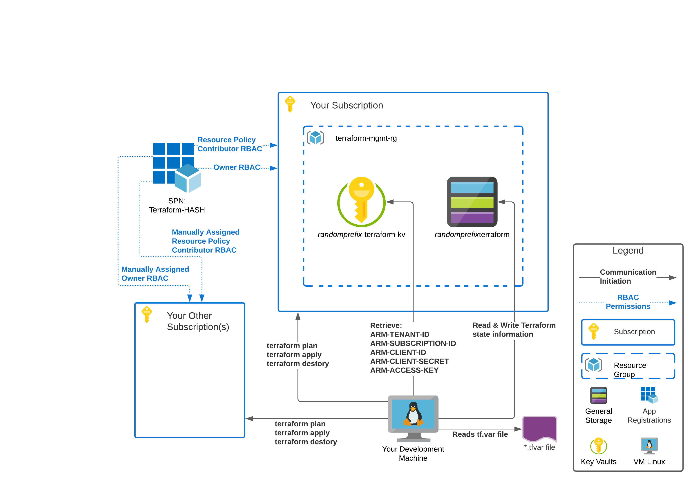

# terraform-azure-bootstrap: Enterprise-grade Terraform work  for the individual 



## Intro 

The terraform-azure-bootstrap project contains two scripts.  The first script ConfigureAzureForSecureTerraformAccess.sh creates the Azure infrastructure store state files as blobs on Azure storage.  It also creates the necessary objects to manage Azure using an SPN from a Terraform perspective.  It does this by creating a resource group, a key vault, and spn and a storage account.  The Key Vault stores the SPN client id and secret securely.  

## Requirements

- AZ Cli
- An Azure Account
- Bash Shell

## Contents

- [Intro](#intro)
- [Requirements](#requirements)
- [Inital Setup](#inital-setup)
- [Bootstrapping](#bootstrapping)
- [Scripts](#scripts)

## Initial Setup 
(once per environment) 

```{r, engine='sh', count_lines}
az account login
cd /setup
./ConfigureAzureForSecureTerraformAccess.sh
source ./LoadAzureTerraformSecretsToEnvVars.sh
cd ../simpleTestResourceGroup
terraform init
terraform plan
```

## Bootstrapping
(per project/environment switch)

```
source ./LoadAzureTerrformSecretsToEnvVars.sh
terraform plan
```

## Scripts

### ConfigureAzureForSecureTerraformAccess.sh

The script creates a resource group, a key vault, a storage account, and an SPN.  It loads the client id, client secret, tenant id, subscription id, and storage account access key into the key vault. Next, the script grants the current user ownership over the key vault. Finally, it uses the current subscription the user is logged into to create the resources.

### LoadAzureTerraformSecretsToEnvVars.sh

This script loads the information in the Azure Key Vault to session variables so that Terraform can use them to execute scripts without 
having to provide the information manually.  It also sets up the access key to a storage account so it can be used to manage terraform state.
 
### bareBonesTools.sh

Bash shell script to install tools necessary to run the other two scripts as well as Terrafrom
