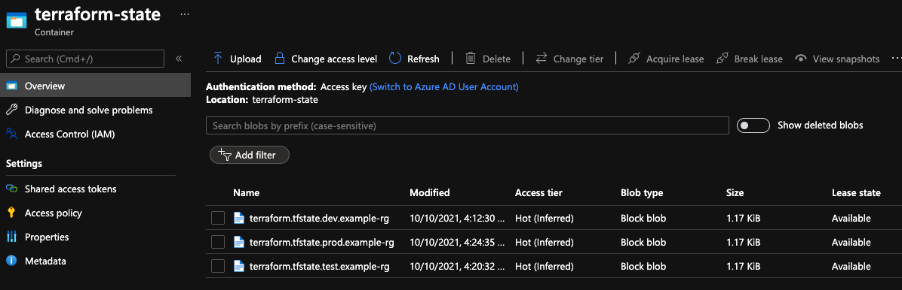

# Example

This example creates three different Azure Resource Groups that are prefixed with the environment name as indicated in the respective tfvars files.  All of the tfvars files are named for an environment in a similarly named directory; the actual name or location of the files does not matter as long as they are referenced properly.  I would suggest the tfvar files remain with the project and outside of the base terraform code.

Executing the script three times as indicated below will create the resource groups and create three different blobs in the Azure Storage Container used to hold terraform state information; each blob is a key and has its own name based on the information in the tfvars file.


## Bootstrapping - from example directory
(per project/environment switch)

```
source ../TerraformAzureBootstrap.sh -f dev/dev.tfvars
terraform apply -var-file dev/dev.tfvars

source ../TerraformAzureBootstrap.sh -f test/test.tfvars
terraform apply -var-file test/test.tfvars

source ../TerraformAzureBootstrap.sh -f prod/prod.tfvars
terraform apply -var-file prod/prod.tfvars

```



